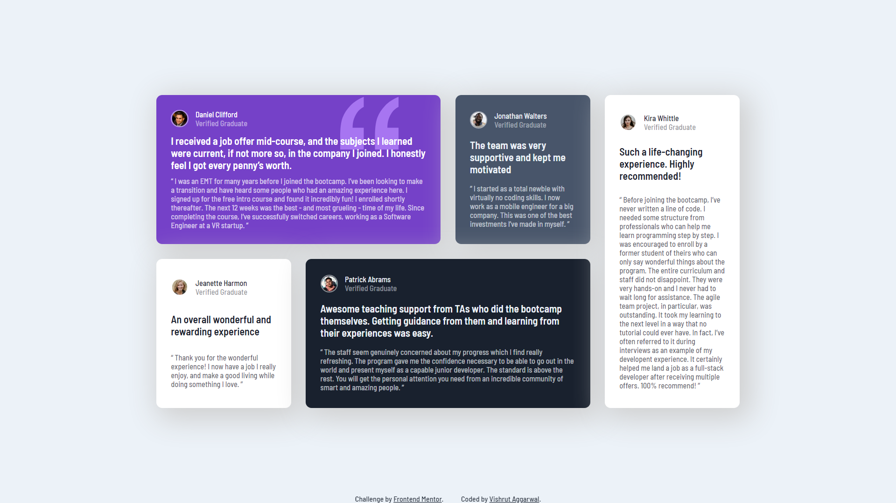
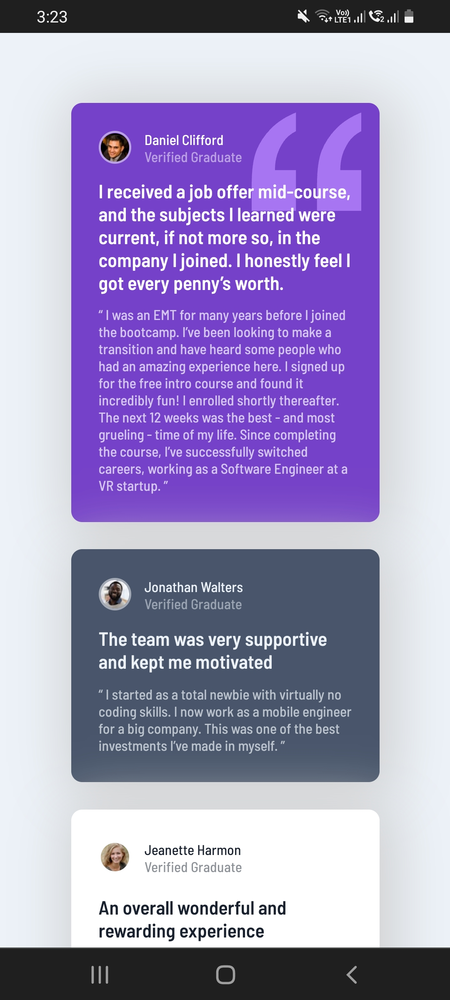
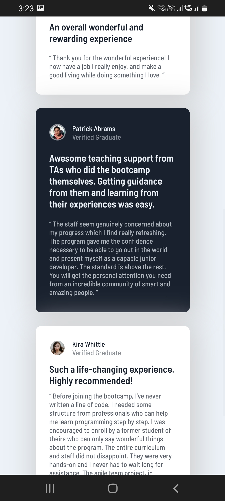
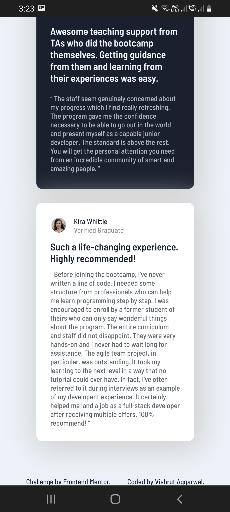

# Frontend Mentor - Testimonials grid section solution

This is a solution to the [Testimonials grid section challenge on Frontend Mentor](https://www.frontendmentor.io/challenges/testimonials-grid-section-Nnw6J7Un7). Frontend Mentor challenges help you improve your coding skills by building realistic projects. 

## Table of contents

- [Overview](#overview)
  - [The challenge](#the-challenge)
  - [Screenshot](#screenshot)
  - [Links](#links)
- [My process](#my-process)
  - [Built with](#built-with)
  - [What I learned](#what-i-learned)
  - [Continued development](#continued-development)
  - [Useful resources](#useful-resources)
- [Author](#author)
- [Acknowledgments](#acknowledgments)

## Overview

### The challenge

Users should be able to:

- View the optimal layout for the site depending on their device's screen size

### Screenshot

Desktop View:

Mobile View:

### Links

- Solution URL: [Add solution URL here](https://github.com/VishrutAggarwal/testimonials-grid-section-main)
- Live Site URL: [Add live site URL here](https://vishrutaggarwal.github.io/testimonials-grid-section-main/)

## My process

First created the HTML structure.
Slowly added the CSS elements.
First the positioning elements were used.
Later the font elements were corrected.
Afterwards, The colors were correctly assigned.
Lastly, some finishing touches were given.

### Built with

- Semantic HTML5 markup
- CSS custom properties
- Flexbox
- CSS Grid

### What I learned

I learned how to properly structure my CSS code and to properly use CSS grid.

### Continued development

I would add mixins for the code to work on different browsers.

### Useful resources

- [W3Schools](https://www.w3schools.com/css/) - This helped me for CSS.
- [MDN Web Docs](https://developer.mozilla.org/en-US/docs/Web/CSS) - This helped me for CSS Grid.

## Author

- Frontend Mentor - [@VishrutAggarwal](https://www.frontendmentor.io/profile/VishrutAggarwal)
- LinkedIn - [Vishrut Aggarwal](https://www.linkedin.com/in/vishrut-aggarwal/)

## Acknowledgments

Thanks to Frontend Mentor to give me this opportunity.